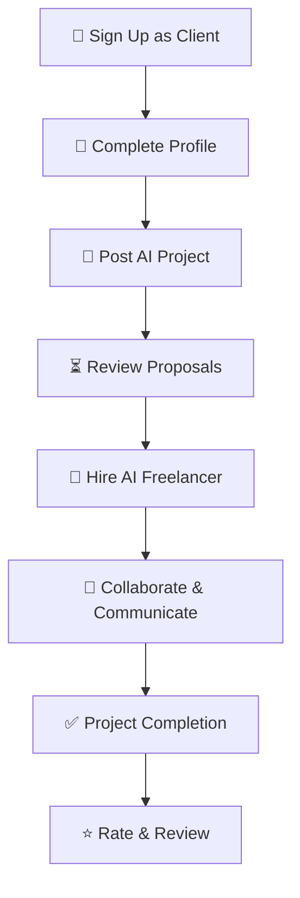
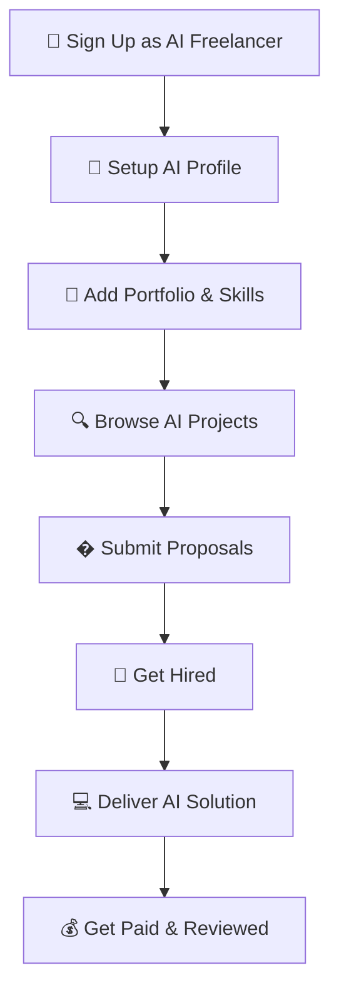
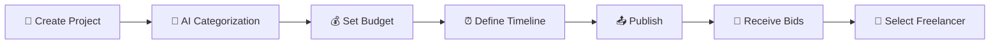

# LLMbeing - AI Freelancing Platform

A specialized freelancing platform focused exclusively on Artificial Intelligence projects. Connect businesses needing AI solutions with skilled AI freelancers.

## What is LLMbeing?

LLMbeing is a web platform where:
- **Clients** can post AI-related projects and hire AI specialists
- **Freelancers** with AI expertise can find projects and build their portfolio
- Both parties can communicate and collaborate on AI solutions

This platform is built specifically for AI work - no general freelancing, just artificial intelligence projects.

## Key Features

### For Clients
- Post AI projects with detailed requirements
- Browse AI freelancer profiles  
- Manage your posted projects
- Communicate with freelancers
- Role-based dashboard experience

### For AI Freelancers  
- Create detailed AI expertise profiles
- Browse and search AI projects
- Build and showcase your AI portfolio
- Apply to projects that match your skills
- Dedicated freelancer dashboard

### Platform Features
- **Role-based navigation** - Different experience for clients vs freelancers
- **User authentication** - Secure JWT-based login system
- **File uploads** - Portfolio images and project files via Cloudinary
- **Responsive design** - Works on desktop, tablet, and mobile
- **Real-time messaging** - Built-in communication system

## Technology Stack

### Frontend
- **React 19.0.0** - Latest React with modern features
- **Vite 6.2.0** - Fast build tool and dev server
- **Redux Toolkit 2.7.0** - State management
- **Tailwind CSS 4.1.4** - Modern CSS framework
- **React Router 7.5.0** - Client-side routing
- **Axios 1.8.4** - HTTP requests
- **Lucide React** - Icon library
- **Motion** - Animations

### Backend
- **Node.js + Express 5.1.0** - Server and API
- **MongoDB + Mongoose 8.13.2** - Database and ODM  
- **JWT 9.0.2** - Authentication tokens
- **bcrypt 5.1.1** - Password hashing
- **Cloudinary 2.6.0** - File storage
- **Socket.io 4.8.1** - Real-time messaging
- **Express Validator** - Input validation

## Getting Started

### Prerequisites
- Node.js 18 or higher
- MongoDB database
- Cloudinary account (for file uploads)

### Installation

1. **Clone the repository**
   ```bash
   git clone https://github.com/yourusername/LLMbeing.git
   cd LLMbeing
   ```

2. **Backend Setup**
   ```bash
   cd backend
   npm install
   
   # Create environment file
   touch .env
   # Add your MongoDB URL, JWT secret, and Cloudinary credentials
   
   npm run dev
   ```

3. **Frontend Setup**
   ```bash
   cd frontend  
   npm install
   npm run dev
   ```

### Environment Variables

Create a `.env` file in the backend directory:

```env
MONGODB_URL=your_mongodb_connection_string
JWT_SECRET=your_jwt_secret_key  
JWT_EXPIRES_IN=7d
CLOUDINARY_CLOUD_NAME=your_cloudinary_cloud_name
CLOUDINARY_API_KEY=your_cloudinary_api_key
CLOUDINARY_API_SECRET=your_cloudinary_api_secret
PORT=3300
```

## How It Works

### Client Workflow
1. Register as a client
2. Complete your profile
3. Post an AI project with requirements and budget
4. Review proposals from AI freelancers
5. Hire and communicate with chosen freelancer

### Freelancer Workflow  
1. Register as an AI freelancer
2. Set up your AI expertise profile
3. Add portfolio items showcasing your AI work
4. Browse available AI projects
5. Submit proposals for projects you're interested in

## API Endpoints

### Authentication
- `POST /api/auth/register` - User registration
- `POST /api/auth/login` - User login
- `POST /api/auth/logout` - User logout

### Projects
- `GET /api/projects/fetchProjects` - Get all projects with pagination
- `POST /api/projects/post` - Create new project (clients only)
- `GET /api/projects/fetchOwnproject` - Get your posted projects
- `PUT /api/projects/edit/:id` - Update project
- `DELETE /api/projects/delete/:id` - Delete project
- `GET /api/projects/fetchprojectdetails/:slug` - Get project details

### User Profiles
- `GET /api/profile/` - Get your profile
- `PUT /api/profile/update` - Update profile
- `POST /api/profile/upload` - Upload profile picture

## Project Structure

```
LLMbeing/
├── backend/
│   ├── controllers/     # API logic
│   ├── models/         # Database schemas  
│   ├── routes/         # API routes
│   ├── middleware/     # Auth, validation, etc.
│   └── utils/          # Helper functions
└── frontend/
    ├── src/
    │   ├── components/  # Reusable UI components
    │   ├── pages/      # Page components
    │   ├── layout/     # Layout wrappers
    │   ├── Redux/      # State management
    │   └── utils/      # Helper functions
    └── public/         # Static assets
```

## Current Status

This is an active development project. Current features:
- ✅ User authentication and authorization
- ✅ Role-based access (client/freelancer)  
- ✅ Project posting and management
- ✅ User profiles with file uploads
- ✅ Responsive UI with modern design
- ✅ Basic messaging infrastructure
- 🚧 Advanced search and filtering
- � Application/proposal system
- � Payment integration
- 🚧 Real-time notifications

## Contributing

1. Fork the repository
2. Create a feature branch
3. Make your changes
4. Test thoroughly
5. Submit a pull request

## License

MIT License - see LICENSE file for details.

## 🤖 For AI Freelancers

### 🏆 **Showcase Your AI Expertise**

<div align="center">

```
┌─────────────────────────────────────┐
│         AI FREELANCER PROFILE       │
├─────────────────────────────────────┤
│ 👤 Professional Identity           │
│ 🧠 AI Specialization Areas         │
│ 💼 Project Portfolio               │
│ 🛠️ Technical Skills & Tools        │
│ ⭐ Client Reviews & Ratings        │
│ 💰 Rates & Availability            │
│ 🎓 Certifications & Education      │
└─────────────────────────────────────┘
```

</div>

### 🎯 **AI Specialization Categories**

<details>
<summary><strong>🤖 LLM & Conversational AI</strong></summary>

- **Custom Chatbot Development**
  - WhatsApp, Telegram, Discord bots
  - Website customer service bots
  - Multi-platform AI assistants
  - Voice-enabled AI interactions

- **Large Language Model Work**
  - GPT fine-tuning and customization
  - Prompt engineering and optimization
  - RAG (Retrieval Augmented Generation) systems
  - Custom AI model development

</details>

<details>
<summary><strong>🔄 AI Automation & Integration</strong></summary>

- **Business Process Automation**
  - Zapier/Make.com AI workflows
  - CRM integration with AI
  - Document processing automation
  - Email and communication AI

- **API & System Integration**
  - OpenAI API implementation
  - Custom AI service development
  - Enterprise AI system integration
  - Cloud AI service orchestration

</details>

<details>
<summary><strong>📊 Machine Learning & Analytics</strong></summary>

- **Predictive Analytics**
  - Sales forecasting models
  - Customer behavior analysis
  - Risk assessment algorithms
  - Business intelligence automation

- **Computer Vision & NLP**
  - Image recognition systems
  - Text analysis and sentiment analysis
  - Document classification
  - OCR and data extraction

</details>

<details>
<summary><strong>🛠️ AI Tools & Applications</strong></summary>

- **Custom AI Applications**
  - Desktop AI assistants
  - Web-based AI tools
  - Mobile AI applications
  - Browser extensions with AI

- **AI-Powered Websites**
  - AI-integrated web platforms
  - Intelligent recommendation systems
  - Dynamic content generation
  - Personalization engines

</details>

### 💼 **Freelancer Dashboard Features**

| Feature | Description |
|---------|-------------|
| **🔍 Smart Project Matching** | Get notified of projects matching your AI expertise |
| **📝 Proposal Management** | Create compelling proposals with portfolio examples |
| **📊 Analytics Dashboard** | Track your performance, earnings, and client satisfaction |
| **💬 Client Communication** | Professional messaging system with file sharing |
| **⚡ Quick Applications** | Apply to projects with saved templates and portfolios |
| **🎯 Skill Verification** | Showcase verified AI skills and certifications |

---

## 🛠️ Technology Stack

### **Frontend (React SPA)**
```javascript
// Modern React with Redux state management
{
  "framework": "React ^19.0.0 + Vite ^6.2.0",
  "stateManagement": "Redux Toolkit ^2.7.0",
  "styling": "Tailwind CSS ^4.1.4",
  "animations": "Motion ^12.7.4",
  "routing": "React Router DOM ^7.5.0",
  "forms": "React Hook Form ^7.56.0",
  "icons": "Lucide React ^0.508.0",
  "httpClient": "Axios ^1.8.4",
  "stateSync": "React Redux ^9.2.0"
}
```

### **Backend (Node.js API)**
```javascript
// RESTful API with comprehensive features
{
  "runtime": "Node.js with Express ^5.1.0",
  "database": "MongoDB with Mongoose ^8.13.2",
  "authentication": "JWT ^9.0.2 + bcrypt ^5.1.1",
  "fileStorage": "Cloudinary ^2.6.0 + Multer ^1.4.5",
  "validation": "Express Validator ^7.2.1",
  "realTime": "Socket.io ^4.8.1",
  "security": "CORS ^2.8.5, cookie-parser ^1.4.7",
  "environment": "dotenv ^16.5.0"
}
```

### **Key Features Architecture**
- **� JWT Authentication** - Secure role-based access (Client/Freelancer/Admin)
- **📁 File Management** - Cloudinary integration for portfolios and project files
- **💬 Real-time Messaging** - Socket.io powered communication system
- **🔍 Advanced Search** - MongoDB aggregation pipelines for complex filtering
- **📊 Analytics** - Comprehensive tracking and reporting
- **🎯 Role-based UI** - Different experiences for clients vs freelancers

---

## 🚀 Getting Started

### **Prerequisites**
- Node.js 18+ and npm/yarn
- MongoDB database
- Cloudinary account (for file storage)

### **Installation**

1. **Clone the repository**
   ```bash
   git clone https://github.com/yourusername/LLMbeing.git
   cd LLMbeing
   ```

2. **Backend Setup**
   ```bash
   cd backend
   npm install
   
   # Create .env file with your configuration
   cp .env.example .env
   # Edit .env with your MongoDB, JWT, and Cloudinary credentials
   
   npm run dev  # Development server on port 3300
   ```

3. **Frontend Setup**
   ```bash
   cd frontend
   npm install
   npm run dev  # Development server on port 5173
   ```

### **Environment Variables**

**Backend (.env)**
```env
# Database
MONGODB_URL=mongodb://localhost:27017/llmbeing

# Authentication
JWT_SECRET=your-super-secret-jwt-key
JWT_EXPIRES_IN=7d

# Cloudinary (File Storage)
CLOUDINARY_CLOUD_NAME=your-cloud-name
CLOUDINARY_API_KEY=your-api-key
CLOUDINARY_API_SECRET=your-api-secret

# Server
PORT=3300
NODE_ENV=development
```

---

## 📱 Platform Workflows

### **Client Journey**


### **Freelancer Journey**


---

## 🎯 User Roles & Features

### **👤 Client Features**
- ✅ Post unlimited AI projects
- ✅ Browse AI freelancer profiles
- ✅ Manage active projects
- ✅ Real-time communication
- ✅ Secure payment processing
- ✅ Review and rating system

### **🤖 AI Freelancer Features**
- ✅ Comprehensive AI skill profiles
- ✅ Portfolio showcase with categories
- ✅ Project proposal system
- ✅ Earnings and analytics dashboard
- ✅ Skill verification badges
- ✅ Client communication tools

### **⚙️ Admin Features**
- ✅ User management and verification
- ✅ Platform analytics and reporting
- ✅ Content moderation tools
- ✅ Payment and dispute management

---

## 🔧 API Endpoints

### **Authentication**
```http
POST /api/v1/auth/register    # User registration
POST /api/v1/auth/login       # User login
POST /api/v1/auth/logout      # User logout
GET  /api/v1/auth/verify      # Verify token
```

### **User Management**
```http
GET    /api/v1/user/profile           # Get user profile
PUT    /api/v1/user/profile           # Update profile
POST   /api/v1/user/profile/upload    # Upload profile picture
POST   /api/v1/user/portfolio         # Add portfolio item
GET    /api/v1/user/profile/:userId   # Get public profile
```

### **Projects**
```http
GET    /api/v1/projects               # Browse projects
POST   /api/v1/projects               # Create project
GET    /api/v1/projects/:id           # Get project details
PUT    /api/v1/projects/:id           # Update project
DELETE /api/v1/projects/:id           # Delete project
```

### **Applications & Bids**
```http
POST   /api/v1/projects/:id/apply     # Apply to project
GET    /api/v1/applications           # Get user applications
PUT    /api/v1/applications/:id       # Update application
```

---

## 🎨 UI/UX Highlights

### **🎯 Role-Based Navigation**
- **Clients**: Post Project → Manage Projects → Messages
- **Freelancers**: Find Projects → Manage Projects → Messages + Search Bar

### **📱 Responsive Design**
- Mobile-first approach with Tailwind CSS
- Optimized for desktop, tablet, and mobile devices
- Modern glassmorphism effects and smooth animations

### **🎨 Design System**
- Consistent color scheme focused on AI/tech aesthetics
- Professional typography with clear hierarchy
- Intuitive icons and micro-interactions

---

## 🔮 Roadmap

### **Phase 1: Core Platform** ✅
- [x] User authentication and profiles
- [x] Project posting and browsing
- [x] Basic messaging system
- [x] Portfolio management

### **Phase 2: Enhanced Features** 🚧
- [ ] Advanced search and filtering
- [ ] Real-time notifications
- [ ] File sharing and collaboration tools
- [ ] Payment integration

### **Phase 3: AI Integration** 📋
- [ ] AI-powered project matching
- [ ] Automated skill assessment
- [ ] Smart proposal recommendations
- [ ] Intelligent project categorization

### **Phase 4: Scale & Growth** 📋
- [ ] Mobile applications
- [ ] Advanced analytics dashboard
- [ ] Multi-language support
- [ ] Enterprise features

---

## 🤝 Contributing

We welcome contributions to make LLMbeing the best AI freelancing platform! Please read our contributing guidelines and feel free to submit issues and pull requests.

1. Fork the repository
2. Create your feature branch (`git checkout -b feature/AmazingFeature`)
3. Commit your changes (`git commit -m 'Add some AmazingFeature'`)
4. Push to the branch (`git push origin feature/AmazingFeature`)
5. Open a Pull Request

---

## 📄 License

This project is licensed under the MIT License - see the [LICENSE.md](LICENSE.md) file for details.

---

## 📞 Contact & Support

- **📧 Email**: support@llmbeing.com
- **🌐 Website**: [www.llmbeing.com](https://www.llmbeing.com)
- **💬 Discord**: [Join our community](https://discord.gg/llmbeing)
- **🐦 Twitter**: [@LLMbeing](https://twitter.com/llmbeing)

---

<div align="center">

**� Built with ❤️ for the AI Community**

*Empowering businesses and AI specialists to create the future together*

[](https://github.com/yourusername/LLMbeing)

</div>
    <td><strong>Secure Platform</strong><br>End-to-end encryption for all communications and file transfers</td>
  </tr>
</table>

---

## 💼 For Clients

### 📝 Project Submission Process



### 🛠️ Client Capabilities

| Feature | Description |
|---------|-------------|
| **Project Creation** | Intuitive interface for detailed project descriptions |
| **Budget Flexibility** | Fixed ranges or negotiable pricing options |
| **File Management** | Secure upload and sharing of project assets |
| **AI Suggestions** | Receive curated freelancer recommendations |
| **Communication Hub** | Built-in messaging system with file sharing |
| **Progress Tracking** | Real-time project milestone monitoring |

---

## 👨‍💻 For Freelancers

### 🏆 Freelancer Profile Features

<div align="center">

```
┌─────────────────────────────────────┐
│            FREELANCER PROFILE       │
├─────────────────────────────────────┤
│ 👤 Professional Identity           │
│ 🎯 Expertise Categories (Max 10)   │
│ 📊 Portfolio & Past Projects       │
│ ⭐ Client Reviews & Ratings        │
│ 🟢 Real-time Online Status         │
│ 💰 Pricing & Availability          │
└─────────────────────────────────────┘
```

</div>

### 🎯 Specialization Areas

<details>
<summary><strong>🧠 AI Development & Integration</strong></summary>

- **Chatbots & Conversational AI**
  - Website FAQ bots
  - Customer service automation
  - Multi-platform messaging bots (WhatsApp, Telegram, Slack)
  - Custom GPT implementations

- **LLM Development & Fine-tuning**
  - Model optimization and customization
  - Prompt engineering and optimization
  - System prompt architecture
  - Multi-turn conversation design

</details>

<details>
<summary><strong>🔄 Automation & Workflow Solutions</strong></summary>

- **Business Process Automation**
  - Zapier/Make.com integrations
  - CRM and sales pipeline automation
  - Document processing workflows
  - Email and communication automation

- **Data Processing & Analysis**
  - Automated reporting systems
  - Data pipeline creation
  - Business intelligence dashboards
  - Predictive analytics implementation

</details>

<details>
<summary><strong>🔌 API & System Integration</strong></summary>

- **Enterprise Integrations**
  - CRM/ERP system connections
  - Database integration and management
  - Webhook and API development
  - Cloud service orchestration

- **Custom Tool Development**
  - AI-powered web applications
  - Mobile app AI features
  - Browser extensions and plugins
  - Desktop automation tools

</details>

<details>
<summary><strong>📊 Advanced AI Applications</strong></summary>

- **Natural Language Processing**
  - Sentiment analysis systems
  - Text classification and categorization
  - Named entity recognition
  - Language translation services

- **Computer Vision & Multimedia**
  - Image recognition and processing
  - Video analysis and automation
  - Audio processing and transcription
  - Content generation and editing

</details>

<details>
<summary><strong>🎨 Creative AI Solutions</strong></summary>

- **Content Generation**
  - Automated copywriting
  - Social media content creation
  - Blog and article generation
  - Marketing material development

- **Design Automation**
  - AI-powered graphic design
  - Brand asset generation
  - Product visualization
  - Creative campaign development

</details>

<details>
<summary><strong>🏢 Enterprise AI Solutions</strong></summary>

- **Strategic Consulting**
  - AI implementation roadmaps
  - Technology stack recommendations
  - ROI analysis and optimization
  - Compliance and risk assessment

- **Custom AI Products**
  - MVP development and prototyping
  - Scalable AI infrastructure
  - Performance optimization
  - Security implementation

</details>

---

## 🛠️ Technology Stack

<div align="center">

### Frontend


### Backend


### Database & Storage


### AI & ML


### DevOps & Deployment


</div>

---

## 🚀 Getting Started

### 📋 Prerequisites

```bash
Node.js >= 18.0.0
Python >= 3.9
MongoDB >= 5.0
Redis >= 6.0
```

### ⚡ Quick Setup

1. **Clone the repository**
   ```bash
   git clone https://github.com/your-username/ai-freelancer-marketplace.git
   cd ai-freelancer-marketplace
   ```

2. **Install dependencies**
   ```bash
   # Frontend
   npm install
   
   # Backend
   cd backend && pip install -r requirements.txt
   ```

3. **Environment configuration**
   ```bash
   cp .env.example .env
   # Configure your API keys and database connections
   ```

4. **Start development servers**
   ```bash
   # Frontend (Port 3000)
   npm run dev
   
   # Backend (Port 8000)
   cd backend && uvicorn main:app --reload
   ```

5. **Access the application**
   - Frontend: `http://localhost:3000`
   - Backend API: `http://localhost:8000`
   - API Documentation: `http://localhost:8000/docs`

---

## 📊 Platform Statistics

<div align="center">

| Metric | Value |
|--------|-------|
| **Active Projects** | 1,500+ |
| **Registered Freelancers** | 750+ |
| **Successful Completions** | 2,300+ |
| **Average Rating** | 4.8/5.0 ⭐ |
| **Response Time** | < 2 hours |

</div>

---

## 🤝 Contributing

We welcome contributions from the community! Please see our [Contributing Guidelines](CONTRIBUTING.md) for details.

### 🐛 Bug Reports
- Use GitHub Issues for bug reports
- Include detailed reproduction steps
- Provide system information and logs

### 💡 Feature Requests
- Discuss new features in GitHub Discussions
- Follow our feature request template
- Consider implementation feasibility

---

## 📄 License

This project is licensed under the MIT License - see the [LICENSE](LICENSE) file for details.

---

## 📞 Support & Contact

<div align="center">

[](https://discord.gg/ai-freelancer)
[](https://t.me/ai_freelancer_marketplace)
[](mailto:support@aifreelancermarketplace.com)

**Need help?** Join our community or reach out to our support team.

</div>

---

## 🙏 Acknowledgments

- OpenAI for AI integration capabilities
- The open-source community for incredible tools and libraries
- Our beta testers and early adopters
- Contributors who made this platform possible

---

<div align="center">

**⭐ Star this repository if you find it useful!**

Made with ❤️ for the AI community

[🔝 Back to Top](#-ai-freelancer-marketplace-platform)

</div>
