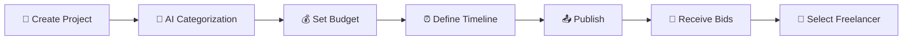

# 🚀 AI Freelancer Marketplace Platform

<div align="center">


**🎯 Connecting businesses with elite AI specialists for cutting-edge solutions**

[📋 Features](#-key-features) • [🚀 Getting Started](#-getting-started) • [💼 For Clients](#-for-clients) • [👨‍💻 For Freelancers](#-for-freelancers) • [🛠️ Tech Stack](#️-technology-stack)

</div>

---

## 📖 Overview

The **AI Freelancer Marketplace Platform** is a comprehensive solution that bridges the gap between businesses seeking AI expertise and skilled freelancers specializing in artificial intelligence technologies. Our platform leverages intelligent matching algorithms to ensure optimal project-freelancer pairings.

### 🎯 Mission
Democratize access to AI expertise while empowering freelancers to showcase their specialized skills in the rapidly evolving AI landscape.

---

## ✨ Key Features

<table>
  <tr>
    <td align="center">🤖</td>
    <td><strong>AI-Powered Matching</strong><br>Smart algorithm suggests optimal freelancers based on project requirements</td>
  </tr>
  <tr>
    <td align="center">🎯</td>
    <td><strong>Auto-Category Detection</strong><br>AI automatically categorizes projects with manual override option</td>
  </tr>
  <tr>
    <td align="center">🔊</td>
    <td><strong>Multi-Modal Input</strong><br>Support for text, audio descriptions, and file uploads</td>
  </tr>
  <tr>
    <td align="center">💬</td>
    <td><strong>Intelligent Bidding</strong><br>Streamlined bidding process with instant communication</td>
  </tr>
  <tr>
    <td align="center">📊</td>
    <td><strong>Real-Time Analytics</strong><br>Track freelancer availability and project progress</td>
  </tr>
  <tr>
    <td align="center">🔒</td>
    <td><strong>Secure Platform</strong><br>End-to-end encryption for all communications and file transfers</td>
  </tr>
</table>

---

## 💼 For Clients

### 📝 Project Submission Process



### 🛠️ Client Capabilities

| Feature | Description |
|---------|-------------|
| **Project Creation** | Intuitive interface for detailed project descriptions |
| **Budget Flexibility** | Fixed ranges or negotiable pricing options |
| **File Management** | Secure upload and sharing of project assets |
| **AI Suggestions** | Receive curated freelancer recommendations |
| **Communication Hub** | Built-in messaging system with file sharing |
| **Progress Tracking** | Real-time project milestone monitoring |

---

## 👨‍💻 For Freelancers

### 🏆 Freelancer Profile Features

<div align="center">

```
┌─────────────────────────────────────┐
│            FREELANCER PROFILE       │
├─────────────────────────────────────┤
│ 👤 Professional Identity           │
│ 🎯 Expertise Categories (Max 10)   │
│ 📊 Portfolio & Past Projects       │
│ ⭐ Client Reviews & Ratings        │
│ 🟢 Real-time Online Status         │
│ 💰 Pricing & Availability          │
└─────────────────────────────────────┘
```

</div>

### 🎯 Specialization Areas

<details>
<summary><strong>🧠 AI Development & Integration</strong></summary>

- **Chatbots & Conversational AI**
  - Website FAQ bots
  - Customer service automation
  - Multi-platform messaging bots (WhatsApp, Telegram, Slack)
  - Custom GPT implementations

- **LLM Development & Fine-tuning**
  - Model optimization and customization
  - Prompt engineering and optimization
  - System prompt architecture
  - Multi-turn conversation design

</details>

<details>
<summary><strong>🔄 Automation & Workflow Solutions</strong></summary>

- **Business Process Automation**
  - Zapier/Make.com integrations
  - CRM and sales pipeline automation
  - Document processing workflows
  - Email and communication automation

- **Data Processing & Analysis**
  - Automated reporting systems
  - Data pipeline creation
  - Business intelligence dashboards
  - Predictive analytics implementation

</details>

<details>
<summary><strong>🔌 API & System Integration</strong></summary>

- **Enterprise Integrations**
  - CRM/ERP system connections
  - Database integration and management
  - Webhook and API development
  - Cloud service orchestration

- **Custom Tool Development**
  - AI-powered web applications
  - Mobile app AI features
  - Browser extensions and plugins
  - Desktop automation tools

</details>

<details>
<summary><strong>📊 Advanced AI Applications</strong></summary>

- **Natural Language Processing**
  - Sentiment analysis systems
  - Text classification and categorization
  - Named entity recognition
  - Language translation services

- **Computer Vision & Multimedia**
  - Image recognition and processing
  - Video analysis and automation
  - Audio processing and transcription
  - Content generation and editing

</details>

<details>
<summary><strong>🎨 Creative AI Solutions</strong></summary>

- **Content Generation**
  - Automated copywriting
  - Social media content creation
  - Blog and article generation
  - Marketing material development

- **Design Automation**
  - AI-powered graphic design
  - Brand asset generation
  - Product visualization
  - Creative campaign development

</details>

<details>
<summary><strong>🏢 Enterprise AI Solutions</strong></summary>

- **Strategic Consulting**
  - AI implementation roadmaps
  - Technology stack recommendations
  - ROI analysis and optimization
  - Compliance and risk assessment

- **Custom AI Products**
  - MVP development and prototyping
  - Scalable AI infrastructure
  - Performance optimization
  - Security implementation

</details>

---

## 🛠️ Technology Stack

<div align="center">

### Frontend


### Backend


### Database & Storage


### AI & ML


### DevOps & Deployment


</div>

---

## 🚀 Getting Started

### 📋 Prerequisites

```bash
Node.js >= 18.0.0
Python >= 3.9
MongoDB >= 5.0
Redis >= 6.0
```

### ⚡ Quick Setup

1. **Clone the repository**
   ```bash
   git clone https://github.com/your-username/ai-freelancer-marketplace.git
   cd ai-freelancer-marketplace
   ```

2. **Install dependencies**
   ```bash
   # Frontend
   npm install
   
   # Backend
   cd backend && pip install -r requirements.txt
   ```

3. **Environment configuration**
   ```bash
   cp .env.example .env
   # Configure your API keys and database connections
   ```

4. **Start development servers**
   ```bash
   # Frontend (Port 3000)
   npm run dev
   
   # Backend (Port 8000)
   cd backend && uvicorn main:app --reload
   ```

5. **Access the application**
   - Frontend: `http://localhost:3000`
   - Backend API: `http://localhost:8000`
   - API Documentation: `http://localhost:8000/docs`

---

## 📊 Platform Statistics

<div align="center">

| Metric | Value |
|--------|-------|
| **Active Projects** | 1,500+ |
| **Registered Freelancers** | 750+ |
| **Successful Completions** | 2,300+ |
| **Average Rating** | 4.8/5.0 ⭐ |
| **Response Time** | < 2 hours |

</div>

---

## 🤝 Contributing

We welcome contributions from the community! Please see our [Contributing Guidelines](CONTRIBUTING.md) for details.

### 🐛 Bug Reports
- Use GitHub Issues for bug reports
- Include detailed reproduction steps
- Provide system information and logs

### 💡 Feature Requests
- Discuss new features in GitHub Discussions
- Follow our feature request template
- Consider implementation feasibility

---

## 📄 License

This project is licensed under the MIT License - see the [LICENSE](LICENSE) file for details.

---

## 📞 Support & Contact

<div align="center">

[](https://discord.gg/ai-freelancer)
[](https://t.me/ai_freelancer_marketplace)
[](mailto:support@aifreelancermarketplace.com)

**Need help?** Join our community or reach out to our support team.

</div>

---

## 🙏 Acknowledgments

- OpenAI for AI integration capabilities
- The open-source community for incredible tools and libraries
- Our beta testers and early adopters
- Contributors who made this platform possible

---

<div align="center">

**⭐ Star this repository if you find it useful!**

Made with ❤️ for the AI community

[🔝 Back to Top](#-ai-freelancer-marketplace-platform)

</div>
