# LLMbeing - AI Freelancer Marketplace

A web platform connecting clients with AI freelancers for various artificial intelligence projects.

## Overview

LLMbeing is a freelancer marketplace focused specifically on AI-related projects. Clients can post projects in various AI categories, and freelancers can browse and bid on projects that match their expertise.

## Current Features

- **User Authentication**: JWT-based authentication with role-based access (client/freelancer)
- **Project Management**: Clients can post projects, freelancers can browse and apply
- **Profile System**: Both clients and freelancers can create detailed profiles
- **Project Categories**: 19 AI-specific categories from chatbots to computer vision
- **File Upload**: Support for project attachments via Cloudinary
- **Responsive Design**: Modern UI with Tailwind CSS

## Development Status

**Currently Implemented:**
- Frontend: React.js with Redux for state management
- Backend: Node.js/Express with MongoDB
- Authentication system with protected routes
- Basic project CRUD operations
- File upload functionality
- Profile management

**In Progress:**
- Bidding system
- Real-time messaging
- Advanced search and filtering
- Payment integration

## Project Categories

The platform supports 19 AI categories:
- AI Chatbots & Virtual Assistants
- Prompt Engineering
- AI Process Automation  
- API Integration & Development
- Content Generation & Writing
- Data Analysis & Insights
- Computer Vision & Image Processing
- Natural Language Processing
- Machine Learning Model Development
- AI Training & Fine-tuning
- AI Strategy & Consulting
- Audio & Voice Technology
- Translation & Localization
- Security & Compliance
- Media Production & Editing
- Research & Development
- AI Tool Integration
## Technology Stack

### Frontend
- **React** 19.0.0 - Modern UI library
- **Redux Toolkit** 2.7.0 - State management
- **React Router DOM** 7.5.0 - Client-side routing
- **Tailwind CSS** 4.1.4 - Utility-first CSS framework
- **Motion** 12.7.4 - Animation library
- **Axios** 1.8.4 - HTTP client
- **Vite** 6.2.0 - Build tool and dev server

### Backend  
- **Node.js** with **Express** 5.1.0 - Server framework
- **MongoDB** with **Mongoose** 8.13.2 - Database and ODM
- **JWT** 9.0.2 - Authentication tokens
- **bcrypt** 5.1.1 - Password hashing
- **Cloudinary** 2.6.0 - File upload and storage
- **Socket.io** 4.8.1 - Real-time communication
- **Express Validator** 7.2.1 - Input validation

## API Endpoints

### Authentication
- `POST /api/auth/register` - User registration
- `POST /api/auth/login` - User login
- `POST /api/auth/logout` - User logout

### Projects
- `GET /api/projects` - Get all projects
- `POST /api/projects` - Create new project (client only)
- `GET /api/projects/:id` - Get project details
- `PUT /api/projects/:id` - Update project (owner only)
- `DELETE /api/projects/:id` - Delete project (owner only)

### Profiles
- `GET /api/profile/:id` - Get user profile
- `PUT /api/profile` - Update profile
- `POST /api/profile/upload-avatar` - Upload profile image

### Applications
- `POST /api/applications` - Apply to project
- `GET /api/applications/project/:projectId` - Get project applications
- `GET /api/applications/user` - Get user's applications

## Installation & Setup

### Prerequisites
- Node.js (v18 or higher)
- MongoDB database
- Cloudinary account for file uploads

### Backend Setup
```bash
cd backend
npm install
cp .env.example .env
# Configure your environment variables
npm run dev
```

### Frontend Setup  
```bash
cd frontend
npm install
npm run dev
```

### Environment Variables
```env
# Backend (.env)
PORT=3000
MONGODB_URI=your_mongodb_connection_string
JWT_SECRET=your_jwt_secret
CLOUDINARY_CLOUD_NAME=your_cloudinary_name
CLOUDINARY_API_KEY=your_cloudinary_key
CLOUDINARY_API_SECRET=your_cloudinary_secret
```

## Project Structure

```
LLMbeing/
├── frontend/           # React.js frontend
│   ├── src/
│   │   ├── components/ # Reusable components
│   │   ├── pages/      # Page components
│   │   ├── layout/     # Layout components
│   │   ├── Redux/      # Redux store and slices
│   │   └── utils/      # Utility functions
│   └── package.json
├── backend/            # Node.js backend
│   ├── controllers/    # Route controllers
│   ├── models/         # Database models
│   ├── routes/         # API routes
│   ├── middleware/     # Custom middleware
│   ├── config/         # Database configuration
│   └── package.json
└── README.md
```

## Contributing

1. Fork the repository
2. Create a feature branch
3. Make your changes
4. Test thoroughly
5. Submit a pull request

## License

This project is licensed under the MIT License.
    <td><strong>Secure Platform</strong><br>End-to-end encryption for all communications and file transfers</td>
  </tr>
</table>

---

## 💼 For Clients

### 📝 Project Submission Process

```mermaid
graph LR
    A[📝 Create Project] --> B[🤖 AI Categorization]
    B --> C[💰 Set Budget]
    C --> D[⏰ Define Timeline]
    D --> E[📤 Publish]
    E --> F[👀 Receive Bids]
    F --> G[🤝 Select Freelancer]
```



### 🛠️ Client Capabilities

| Feature | Description |
|---------|-------------|
| **Project Creation** | Intuitive interface for detailed project descriptions |
| **Budget Flexibility** | Fixed ranges or negotiable pricing options |
| **File Management** | Secure upload and sharing of project assets |
| **AI Suggestions** | Receive curated freelancer recommendations |
| **Communication Hub** | Built-in messaging system with file sharing |
| **Progress Tracking** | Real-time project milestone monitoring |

---

## 👨‍💻 For Freelancers

### 🏆 Freelancer Profile Features

<div align="center">

```
┌─────────────────────────────────────┐
│            FREELANCER PROFILE       │
├─────────────────────────────────────┤
│ 👤 Professional Identity           │
│ 🎯 Expertise Categories (Max 10)   │
│ 📊 Portfolio & Past Projects       │
│ ⭐ Client Reviews & Ratings        │
│ 🟢 Real-time Online Status         │
│ 💰 Pricing & Availability          │
└─────────────────────────────────────┘
```

</div>

### 🎯 Specialization Areas

<details>
<summary><strong>🧠 AI Development & Integration</strong></summary>

- **Chatbots & Conversational AI**
  - Website FAQ bots
  - Customer service automation
  - Multi-platform messaging bots (WhatsApp, Telegram, Slack)
  - Custom GPT implementations

- **LLM Development & Fine-tuning**
  - Model optimization and customization
  - Prompt engineering and optimization
  - System prompt architecture
  - Multi-turn conversation design

</details>

<details>
<summary><strong>🔄 Automation & Workflow Solutions</strong></summary>

- **Business Process Automation**
  - Zapier/Make.com integrations
  - CRM and sales pipeline automation
  - Document processing workflows
  - Email and communication automation

- **Data Processing & Analysis**
  - Automated reporting systems
  - Data pipeline creation
  - Business intelligence dashboards
  - Predictive analytics implementation

</details>

<details>
<summary><strong>🔌 API & System Integration</strong></summary>

- **Enterprise Integrations**
  - CRM/ERP system connections
  - Database integration and management
  - Webhook and API development
  - Cloud service orchestration

- **Custom Tool Development**
  - AI-powered web applications
  - Mobile app AI features
  - Browser extensions and plugins
  - Desktop automation tools

</details>

<details>
<summary><strong>📊 Advanced AI Applications</strong></summary>

- **Natural Language Processing**
  - Sentiment analysis systems
  - Text classification and categorization
  - Named entity recognition
  - Language translation services

- **Computer Vision & Multimedia**
  - Image recognition and processing
  - Video analysis and automation
  - Audio processing and transcription
  - Content generation and editing

</details>

<details>
<summary><strong>🎨 Creative AI Solutions</strong></summary>

- **Content Generation**
  - Automated copywriting
  - Social media content creation
  - Blog and article generation
  - Marketing material development

- **Design Automation**
  - AI-powered graphic design
  - Brand asset generation
  - Product visualization
  - Creative campaign development

</details>

<details>
<summary><strong>🏢 Enterprise AI Solutions</strong></summary>

- **Strategic Consulting**
  - AI implementation roadmaps
  - Technology stack recommendations
  - ROI analysis and optimization
  - Compliance and risk assessment

- **Custom AI Products**
  - MVP development and prototyping
  - Scalable AI infrastructure
  - Performance optimization
  - Security implementation

</details>

---

## 🛠️ Technology Stack

<div align="center">

### Frontend


### Backend


### Database & Storage


### AI & ML


### DevOps & Deployment


</div>

---

## 🚀 Getting Started

### 📋 Prerequisites

```bash
Node.js >= 18.0.0
Python >= 3.9
MongoDB >= 5.0
Redis >= 6.0
```

### ⚡ Quick Setup

1. **Clone the repository**
   ```bash
   git clone https://github.com/your-username/ai-freelancer-marketplace.git
   cd ai-freelancer-marketplace
   ```

2. **Install dependencies**
   ```bash
   # Frontend
   npm install
   
   # Backend
   cd backend && pip install -r requirements.txt
   ```

3. **Environment configuration**
   ```bash
   cp .env.example .env
   # Configure your API keys and database connections
   ```

4. **Start development servers**
   ```bash
   # Frontend (Port 3000)
   npm run dev
   
   # Backend (Port 8000)
   cd backend && uvicorn main:app --reload
   ```

5. **Access the application**
   - Frontend: `http://localhost:3000`
   - Backend API: `http://localhost:8000`
   - API Documentation: `http://localhost:8000/docs`

---

## 📊 Platform Statistics

<div align="center">

| Metric | Value |
|--------|-------|
| **Active Projects** | 1,500+ |
| **Registered Freelancers** | 750+ |
| **Successful Completions** | 2,300+ |
| **Average Rating** | 4.8/5.0 ⭐ |
| **Response Time** | < 2 hours |

</div>

---

## 🤝 Contributing

We welcome contributions from the community! Please see our [Contributing Guidelines](CONTRIBUTING.md) for details.

### 🐛 Bug Reports
- Use GitHub Issues for bug reports
- Include detailed reproduction steps
- Provide system information and logs

### 💡 Feature Requests
- Discuss new features in GitHub Discussions
- Follow our feature request template
- Consider implementation feasibility

---

## 📄 License

This project is licensed under the MIT License - see the [LICENSE](LICENSE) file for details.

---

## 📞 Support & Contact

<div align="center">

[](https://discord.gg/ai-freelancer)
[](https://t.me/ai_freelancer_marketplace)
[](mailto:support@aifreelancermarketplace.com)

**Need help?** Join our community or reach out to our support team.

</div>

---

## 🙏 Acknowledgments

- OpenAI for AI integration capabilities
- The open-source community for incredible tools and libraries
- Our beta testers and early adopters
- Contributors who made this platform possible

---

<div align="center">

**⭐ Star this repository if you find it useful!**

Made with ❤️ for the AI community

[🔝 Back to Top](#-ai-freelancer-marketplace-platform)

</div>
