# 🤖 LLMbeing - AI Freelancing Marketplace

<div align="center">


**🎯 The Premier Marketplace Connecting Businesses with AI Specialists**

*Exclusively focused on Artificial Intelligence work and solutions*

[📋 Features](#-key-features) • [🚀 Getting Started](#-getting-started) • [💼 For Clients](#-for-clients) • [🤖 For AI Freelancers](#-for-ai-freelancers) • [🛠️ Tech Stack](#️-technology-stack)

</div>

---

## 📖 Overview

**LLMbeing** is a specialized freelancing platform designed exclusively for **Artificial Intelligence work**. We connect businesses seeking AI expertise with skilled freelancers who specialize in LLMs, machine learning, automation, and AI integration projects.

### 🎯 Mission
Bridge the gap between businesses needing AI solutions and talented AI specialists, creating a focused ecosystem for artificial intelligence freelancing.

### 🌟 Why Choose LLMbeing?
- **🎯 AI-Only Focus**: Specialized platform exclusively for AI projects
- **🧠 Expert Network**: Curated community of verified AI specialists  
- **🔗 Smart Matching**: Advanced algorithms to match projects with the right talent
- **⚡ Rapid Deployment**: Streamlined processes for quick project starts
- **🔒 Enterprise Security**: Bank-level security for sensitive AI projects

---

## ✨ Key Features

### 🚀 **For Everyone**
<table>
  <tr>
    <td align="center">🤖</td>
    <td><strong>AI-Specialized Platform</strong><br>100% focused on artificial intelligence projects and solutions</td>
  </tr>
  <tr>
    <td align="center">🎯</td>
    <td><strong>Role-Based Experience</strong><br>Tailored interface for clients vs. AI freelancers</td>
  </tr>
  <tr>
    <td align="center">🔍</td>
    <td><strong>Advanced Search & Filtering</strong><br>Find exactly what you need with intelligent categorization</td>
  </tr>
  <tr>
    <td align="center">💬</td>
    <td><strong>Real-time Communication</strong><br>Built-in messaging system for seamless collaboration</td>
  </tr>
  <tr>
    <td align="center">📊</td>
    <td><strong>Comprehensive Profiles</strong><br>Detailed profiles showcasing AI expertise and past projects</td>
  </tr>
  <tr>
    <td align="center">🔒</td>
    <td><strong>Secure & Professional</strong><br>Enterprise-grade security with professional workflows</td>
  </tr>
</table>

---

## 💼 For Clients

### 📝 **Post AI Projects with Ease**

```mermaid
graph LR
    A[📝 Post Project] --> B[🎯 Set Requirements]
    B --> C[💰 Define Budget]
    C --> D[📤 Publish]
    D --> E[👀 Review Proposals]
    E --> F[🤝 Hire AI Expert]
```



### 🛠️ **Client Dashboard Features**

| Feature | Description |
|---------|-------------|
| **🚀 Quick Project Posting** | Streamlined form to post AI projects with detailed requirements |
| **💰 Flexible Budgeting** | Set fixed or hourly rates, define project scope and timeline |
| **🔍 AI Expert Discovery** | Browse and search for AI specialists by expertise area |
| **📊 Project Management** | Track active projects, milestones, and deliverables |
| **💬 Direct Communication** | Built-in messaging system for project discussions |
| **⭐ Review & Rating System** | Rate freelancers and build your network of trusted AI experts |

### 🎯 **Types of AI Projects You Can Post**
- **🤖 Chatbot Development** - Custom AI chatbots and conversational interfaces
- **🧠 LLM Integration** - Large Language Model implementation and fine-tuning
- **🔄 Business Automation** - AI-powered workflow automation and optimization
- **📊 Data Analysis & ML** - Machine learning models and data insights
- **🔌 API Integration** - AI service integration and custom API development
- **📈 Predictive Analytics** - Forecasting and business intelligence solutions

---

## 🤖 For AI Freelancers

### 🏆 **Showcase Your AI Expertise**

<div align="center">

```
┌─────────────────────────────────────┐
│         AI FREELANCER PROFILE       │
├─────────────────────────────────────┤
│ 👤 Professional Identity           │
│ 🧠 AI Specialization Areas         │
│ 💼 Project Portfolio               │
│ 🛠️ Technical Skills & Tools        │
│ ⭐ Client Reviews & Ratings        │
│ 💰 Rates & Availability            │
│ 🎓 Certifications & Education      │
└─────────────────────────────────────┘
```

</div>

### 🎯 **AI Specialization Categories**

<details>
<summary><strong>🤖 LLM & Conversational AI</strong></summary>

- **Custom Chatbot Development**
  - WhatsApp, Telegram, Discord bots
  - Website customer service bots
  - Multi-platform AI assistants
  - Voice-enabled AI interactions

- **Large Language Model Work**
  - GPT fine-tuning and customization
  - Prompt engineering and optimization
  - RAG (Retrieval Augmented Generation) systems
  - Custom AI model development

</details>

<details>
<summary><strong>🔄 AI Automation & Integration</strong></summary>

- **Business Process Automation**
  - Zapier/Make.com AI workflows
  - CRM integration with AI
  - Document processing automation
  - Email and communication AI

- **API & System Integration**
  - OpenAI API implementation
  - Custom AI service development
  - Enterprise AI system integration
  - Cloud AI service orchestration

</details>

<details>
<summary><strong>📊 Machine Learning & Analytics</strong></summary>

- **Predictive Analytics**
  - Sales forecasting models
  - Customer behavior analysis
  - Risk assessment algorithms
  - Business intelligence automation

- **Computer Vision & NLP**
  - Image recognition systems
  - Text analysis and sentiment analysis
  - Document classification
  - OCR and data extraction

</details>

<details>
<summary><strong>🛠️ AI Tools & Applications</strong></summary>

- **Custom AI Applications**
  - Desktop AI assistants
  - Web-based AI tools
  - Mobile AI applications
  - Browser extensions with AI

- **AI-Powered Websites**
  - AI-integrated web platforms
  - Intelligent recommendation systems
  - Dynamic content generation
  - Personalization engines

</details>

### 💼 **Freelancer Dashboard Features**

| Feature | Description |
|---------|-------------|
| **🔍 Smart Project Matching** | Get notified of projects matching your AI expertise |
| **📝 Proposal Management** | Create compelling proposals with portfolio examples |
| **📊 Analytics Dashboard** | Track your performance, earnings, and client satisfaction |
| **💬 Client Communication** | Professional messaging system with file sharing |
| **⚡ Quick Applications** | Apply to projects with saved templates and portfolios |
| **🎯 Skill Verification** | Showcase verified AI skills and certifications |

---

## 🛠️ Technology Stack

### **Frontend (React SPA)**
```javascript
// Modern React with Redux state management
{
  "framework": "React 19.0.0 + Vite",
  "stateManagement": "Redux Toolkit",
  "styling": "Tailwind CSS 4.x",
  "animations": "Motion (Framer Motion)",
  "routing": "React Router DOM 7.x",
  "forms": "React Hook Form",
  "icons": "Lucide React",
  "httpClient": "Axios"
}
```

### **Backend (Node.js API)**
```javascript
// RESTful API with comprehensive features
{
  "runtime": "Node.js with Express 5.x",
  "database": "MongoDB with Mongoose ODM",
  "authentication": "JWT + bcrypt",
  "fileStorage": "Cloudinary integration",
  "validation": "Express Validator",
  "realTime": "Socket.io for messaging",
  "security": "CORS, cookie-parser, encryption"
}
```

### **Key Features Architecture**
- **� JWT Authentication** - Secure role-based access (Client/Freelancer/Admin)
- **📁 File Management** - Cloudinary integration for portfolios and project files
- **💬 Real-time Messaging** - Socket.io powered communication system
- **🔍 Advanced Search** - MongoDB aggregation pipelines for complex filtering
- **📊 Analytics** - Comprehensive tracking and reporting
- **🎯 Role-based UI** - Different experiences for clients vs freelancers

---

## 🚀 Getting Started

### **Prerequisites**
- Node.js 18+ and npm/yarn
- MongoDB database
- Cloudinary account (for file storage)

### **Installation**

1. **Clone the repository**
   ```bash
   git clone https://github.com/yourusername/LLMbeing.git
   cd LLMbeing
   ```

2. **Backend Setup**
   ```bash
   cd backend
   npm install
   
   # Create .env file with your configuration
   cp .env.example .env
   # Edit .env with your MongoDB, JWT, and Cloudinary credentials
   
   npm run dev  # Development server on port 3300
   ```

3. **Frontend Setup**
   ```bash
   cd frontend
   npm install
   npm run dev  # Development server on port 5173
   ```

### **Environment Variables**

**Backend (.env)**
```env
# Database
MONGODB_URL=mongodb://localhost:27017/llmbeing

# Authentication
JWT_SECRET=your-super-secret-jwt-key
JWT_EXPIRES_IN=7d

# Cloudinary (File Storage)
CLOUDINARY_CLOUD_NAME=your-cloud-name
CLOUDINARY_API_KEY=your-api-key
CLOUDINARY_API_SECRET=your-api-secret

# Server
PORT=3300
NODE_ENV=development
```

---

## 📱 Platform Workflows

### **Client Journey**

```mermaid
graph TD
    A[🔐 Sign Up as Client] --> B[📝 Complete Profile]
    B --> C[🚀 Post AI Project]
    C --> D[⏳ Review Proposals]
    D --> E[🤝 Hire AI Freelancer]
    E --> F[💬 Collaborate & Communicate]
    F --> G[✅ Project Completion]
    G --> H[⭐ Rate & Review]
```


### **Freelancer Journey**

```mermaid
graph TD
    A[🔐 Sign Up as AI Freelancer] --> B[🧠 Setup AI Profile]
    B --> C[💼 Add Portfolio & Skills]
    C --> D[🔍 Browse AI Projects]
    D --> E[� Submit Proposals]
    E --> F[🎯 Get Hired]
    F --> G[💻 Deliver AI Solution]
    G --> H[💰 Get Paid & Reviewed]
```


---

## 🎯 User Roles & Features

### **👤 Client Features**
- ✅ Post unlimited AI projects
- ✅ Browse AI freelancer profiles
- ✅ Manage active projects
- ✅ Real-time communication
- ✅ Secure payment processing
- ✅ Review and rating system

### **🤖 AI Freelancer Features**
- ✅ Comprehensive AI skill profiles
- ✅ Portfolio showcase with categories
- ✅ Project proposal system
- ✅ Earnings and analytics dashboard
- ✅ Skill verification badges
- ✅ Client communication tools

### **⚙️ Admin Features**
- ✅ User management and verification
- ✅ Platform analytics and reporting
- ✅ Content moderation tools
- ✅ Payment and dispute management

---

## 🔧 API Endpoints

### **Authentication**
```http
POST /api/v1/auth/register    # User registration
POST /api/v1/auth/login       # User login
POST /api/v1/auth/logout      # User logout
GET  /api/v1/auth/verify      # Verify token
```

### **User Management**
```http
GET    /api/v1/user/profile           # Get user profile
PUT    /api/v1/user/profile           # Update profile
POST   /api/v1/user/profile/upload    # Upload profile picture
POST   /api/v1/user/portfolio         # Add portfolio item
GET    /api/v1/user/profile/:userId   # Get public profile
```

### **Projects**
```http
GET    /api/v1/projects               # Browse projects
POST   /api/v1/projects               # Create project
GET    /api/v1/projects/:id           # Get project details
PUT    /api/v1/projects/:id           # Update project
DELETE /api/v1/projects/:id           # Delete project
```

### **Applications & Bids**
```http
POST   /api/v1/projects/:id/apply     # Apply to project
GET    /api/v1/applications           # Get user applications
PUT    /api/v1/applications/:id       # Update application
```

---

## 🎨 UI/UX Highlights

### **🎯 Role-Based Navigation**
- **Clients**: Post Project → Manage Projects → Messages
- **Freelancers**: Find Projects → Manage Projects → Messages + Search Bar

### **📱 Responsive Design**
- Mobile-first approach with Tailwind CSS
- Optimized for desktop, tablet, and mobile devices
- Modern glassmorphism effects and smooth animations

### **🎨 Design System**
- Consistent color scheme focused on AI/tech aesthetics
- Professional typography with clear hierarchy
- Intuitive icons and micro-interactions

---

## 🔮 Roadmap

### **Phase 1: Core Platform** ✅
- [x] User authentication and profiles
- [x] Project posting and browsing
- [x] Basic messaging system
- [x] Portfolio management

### **Phase 2: Enhanced Features** 🚧
- [ ] Advanced search and filtering
- [ ] Real-time notifications
- [ ] File sharing and collaboration tools
- [ ] Payment integration

### **Phase 3: AI Integration** 📋
- [ ] AI-powered project matching
- [ ] Automated skill assessment
- [ ] Smart proposal recommendations
- [ ] Intelligent project categorization

### **Phase 4: Scale & Growth** 📋
- [ ] Mobile applications
- [ ] Advanced analytics dashboard
- [ ] Multi-language support
- [ ] Enterprise features

---

## 🤝 Contributing

We welcome contributions to make LLMbeing the best AI freelancing platform! Please read our contributing guidelines and feel free to submit issues and pull requests.

1. Fork the repository
2. Create your feature branch (`git checkout -b feature/AmazingFeature`)
3. Commit your changes (`git commit -m 'Add some AmazingFeature'`)
4. Push to the branch (`git push origin feature/AmazingFeature`)
5. Open a Pull Request

---

## 📄 License

This project is licensed under the MIT License - see the [LICENSE.md](LICENSE.md) file for details.

---

## 📞 Contact & Support

- **📧 Email**: support@llmbeing.com
- **🌐 Website**: [www.llmbeing.com](https://www.llmbeing.com)
- **💬 Discord**: [Join our community](https://discord.gg/llmbeing)
- **🐦 Twitter**: [@LLMbeing](https://twitter.com/llmbeing)

---

<div align="center">

**� Built with ❤️ for the AI Community**

*Empowering businesses and AI specialists to create the future together*

[](https://github.com/yourusername/LLMbeing)

</div>
    <td><strong>Secure Platform</strong><br>End-to-end encryption for all communications and file transfers</td>
  </tr>
</table>

---

## 💼 For Clients

### 📝 Project Submission Process

```mermaid
graph LR
    A[📝 Create Project] --> B[🤖 AI Categorization]
    B --> C[💰 Set Budget]
    C --> D[⏰ Define Timeline]
    D --> E[📤 Publish]
    E --> F[👀 Receive Bids]
    F --> G[🤝 Select Freelancer]
```



### 🛠️ Client Capabilities

| Feature | Description |
|---------|-------------|
| **Project Creation** | Intuitive interface for detailed project descriptions |
| **Budget Flexibility** | Fixed ranges or negotiable pricing options |
| **File Management** | Secure upload and sharing of project assets |
| **AI Suggestions** | Receive curated freelancer recommendations |
| **Communication Hub** | Built-in messaging system with file sharing |
| **Progress Tracking** | Real-time project milestone monitoring |

---

## 👨‍💻 For Freelancers

### 🏆 Freelancer Profile Features

<div align="center">

```
┌─────────────────────────────────────┐
│            FREELANCER PROFILE       │
├─────────────────────────────────────┤
│ 👤 Professional Identity           │
│ 🎯 Expertise Categories (Max 10)   │
│ 📊 Portfolio & Past Projects       │
│ ⭐ Client Reviews & Ratings        │
│ 🟢 Real-time Online Status         │
│ 💰 Pricing & Availability          │
└─────────────────────────────────────┘
```

</div>

### 🎯 Specialization Areas

<details>
<summary><strong>🧠 AI Development & Integration</strong></summary>

- **Chatbots & Conversational AI**
  - Website FAQ bots
  - Customer service automation
  - Multi-platform messaging bots (WhatsApp, Telegram, Slack)
  - Custom GPT implementations

- **LLM Development & Fine-tuning**
  - Model optimization and customization
  - Prompt engineering and optimization
  - System prompt architecture
  - Multi-turn conversation design

</details>

<details>
<summary><strong>🔄 Automation & Workflow Solutions</strong></summary>

- **Business Process Automation**
  - Zapier/Make.com integrations
  - CRM and sales pipeline automation
  - Document processing workflows
  - Email and communication automation

- **Data Processing & Analysis**
  - Automated reporting systems
  - Data pipeline creation
  - Business intelligence dashboards
  - Predictive analytics implementation

</details>

<details>
<summary><strong>🔌 API & System Integration</strong></summary>

- **Enterprise Integrations**
  - CRM/ERP system connections
  - Database integration and management
  - Webhook and API development
  - Cloud service orchestration

- **Custom Tool Development**
  - AI-powered web applications
  - Mobile app AI features
  - Browser extensions and plugins
  - Desktop automation tools

</details>

<details>
<summary><strong>📊 Advanced AI Applications</strong></summary>

- **Natural Language Processing**
  - Sentiment analysis systems
  - Text classification and categorization
  - Named entity recognition
  - Language translation services

- **Computer Vision & Multimedia**
  - Image recognition and processing
  - Video analysis and automation
  - Audio processing and transcription
  - Content generation and editing

</details>

<details>
<summary><strong>🎨 Creative AI Solutions</strong></summary>

- **Content Generation**
  - Automated copywriting
  - Social media content creation
  - Blog and article generation
  - Marketing material development

- **Design Automation**
  - AI-powered graphic design
  - Brand asset generation
  - Product visualization
  - Creative campaign development

</details>

<details>
<summary><strong>🏢 Enterprise AI Solutions</strong></summary>

- **Strategic Consulting**
  - AI implementation roadmaps
  - Technology stack recommendations
  - ROI analysis and optimization
  - Compliance and risk assessment

- **Custom AI Products**
  - MVP development and prototyping
  - Scalable AI infrastructure
  - Performance optimization
  - Security implementation

</details>

---

## 🛠️ Technology Stack

<div align="center">

### Frontend


### Backend


### Database & Storage


### AI & ML


### DevOps & Deployment


</div>

---

## 🚀 Getting Started

### 📋 Prerequisites

```bash
Node.js >= 18.0.0
Python >= 3.9
MongoDB >= 5.0
Redis >= 6.0
```

### ⚡ Quick Setup

1. **Clone the repository**
   ```bash
   git clone https://github.com/your-username/ai-freelancer-marketplace.git
   cd ai-freelancer-marketplace
   ```

2. **Install dependencies**
   ```bash
   # Frontend
   npm install
   
   # Backend
   cd backend && pip install -r requirements.txt
   ```

3. **Environment configuration**
   ```bash
   cp .env.example .env
   # Configure your API keys and database connections
   ```

4. **Start development servers**
   ```bash
   # Frontend (Port 3000)
   npm run dev
   
   # Backend (Port 8000)
   cd backend && uvicorn main:app --reload
   ```

5. **Access the application**
   - Frontend: `http://localhost:3000`
   - Backend API: `http://localhost:8000`
   - API Documentation: `http://localhost:8000/docs`

---

## 📊 Platform Statistics

<div align="center">

| Metric | Value |
|--------|-------|
| **Active Projects** | 1,500+ |
| **Registered Freelancers** | 750+ |
| **Successful Completions** | 2,300+ |
| **Average Rating** | 4.8/5.0 ⭐ |
| **Response Time** | < 2 hours |

</div>

---

## 🤝 Contributing

We welcome contributions from the community! Please see our [Contributing Guidelines](CONTRIBUTING.md) for details.

### 🐛 Bug Reports
- Use GitHub Issues for bug reports
- Include detailed reproduction steps
- Provide system information and logs

### 💡 Feature Requests
- Discuss new features in GitHub Discussions
- Follow our feature request template
- Consider implementation feasibility

---

## 📄 License

This project is licensed under the MIT License - see the [LICENSE](LICENSE) file for details.

---

## 📞 Support & Contact

<div align="center">

[](https://discord.gg/ai-freelancer)
[](https://t.me/ai_freelancer_marketplace)
[](mailto:support@aifreelancermarketplace.com)

**Need help?** Join our community or reach out to our support team.

</div>

---

## 🙏 Acknowledgments

- OpenAI for AI integration capabilities
- The open-source community for incredible tools and libraries
- Our beta testers and early adopters
- Contributors who made this platform possible

---

<div align="center">

**⭐ Star this repository if you find it useful!**

Made with ❤️ for the AI community

[🔝 Back to Top](#-ai-freelancer-marketplace-platform)

</div>
